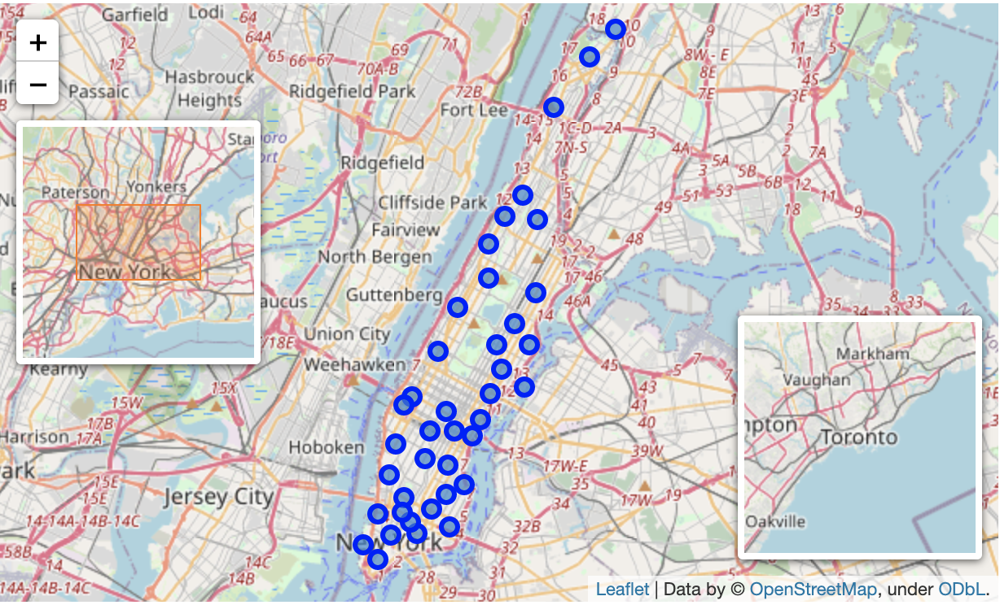
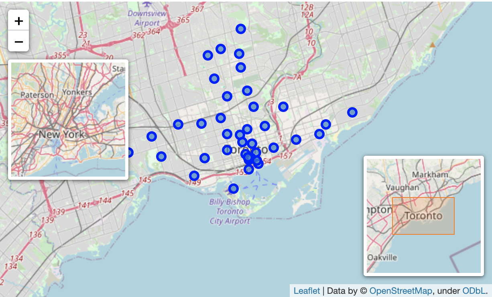
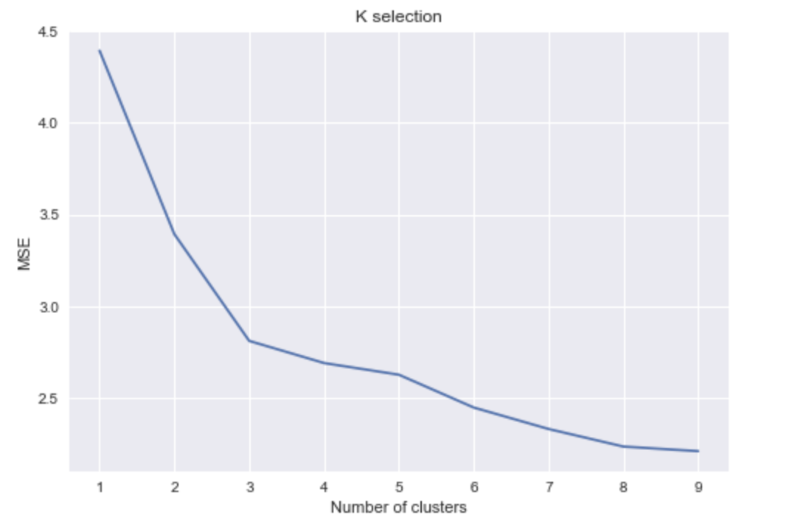
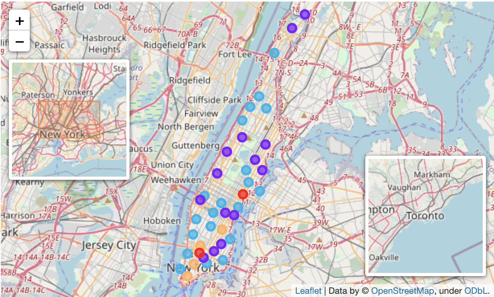
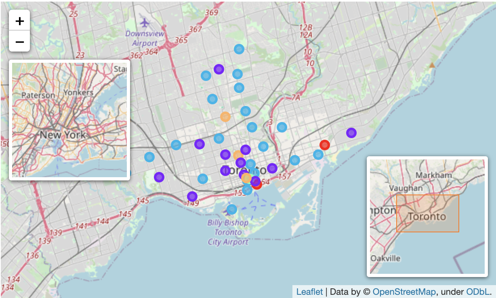
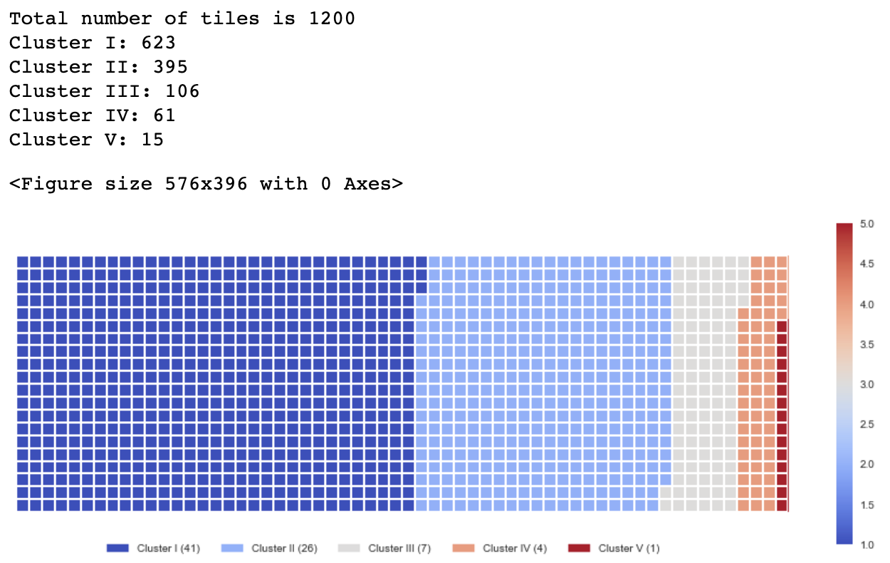
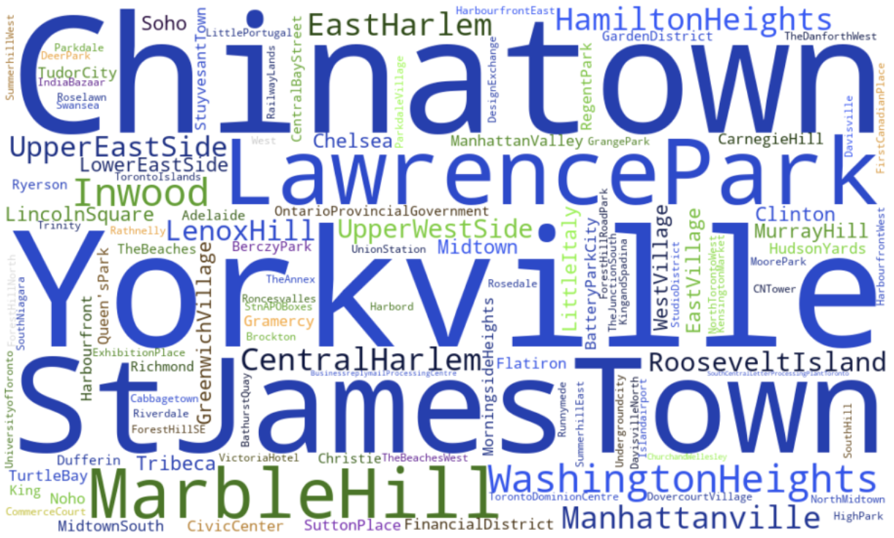
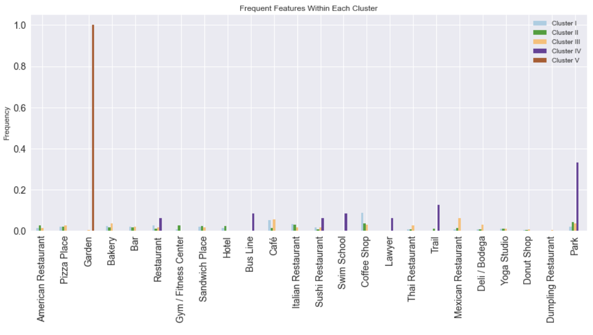
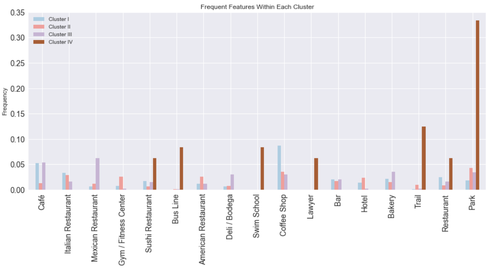

## 
 Data Alaysis of similarities of cities between New York and Toronto

### 
 Dongchul Choi

### 1. Introduction

Recently, Machine Learning (ML) algorithms are widely used in the study of data instead of traditional statistics. ML algorithms bring advantages because they offer solutions to problems related to the big quantities of data and set fewer constraints than traditional statistics. In particular, unsupervised learning algorithms are used to find patterns in data in terms of similarity between samples. Depending on the pattern within the data, different algorithms are used. For non-convex data it is used Density-Based Spatial Clustering (DBSCAN). On the other hand, for convex data it is used a well known algorithm as K-Means. 

Foursquare is a website where people comment and rank food sites, coffee sites, malls and parks. For instance, let's think of a person who has to move from New York city, USA to the city of Toronto, Canada or vice versa. Foursquare location data along with a clustering algorithm can suggest a neighborhood in order to help the one to live in Toronto in a similar place. The neighborhood that will be suggested, will not be a random suggestion, but instead will be a place for his pleasure. Thus, the clustered location data from New York and Toronto will be used to predict a good living neighborhood for the one.

### 2. Data

For this project, the Foursquare API will be used. A list of neighborhoods in New York and Toronto is web-crawled or scraped and their respective location in longitude and latitude coordinates is obtained by Geocoder library. The sources are the following: 

* New York neighborhoods: https://cocl.us/new_york_dataset
* Toronto neighborhoods: https://en.wikipedia.org/wiki/List_of_postal_codes_of_Canada:_M

The data is the neighborhoods located in New York and Toronto. Moreover, their specific coordinates are merged. Only Manhattan neighborhoods and boroughs that contain the string "Toronto" are taken into account for the segmenting the areas. A Foursquare API GET request is sent in order to acquire the nearby venues that are within a radius of 500m. The data is formatted using one hot encoding with the categories of each venue. Then, the venues are grouped by neighborhoods computing the mean of each feature.

The similarities will be determined based on the frequency of the categories found in the neighborhoods. These similarities are a strong indicator and can help the one to decide whether to move in a particular neighborhood with the preference of the similarity of the previous neighborhood 

### 3. Methodology

#### 3.1. Feature Extraction

For feature extraction, One Hot Encoding is used in terms of categories. Therefore, each feature is a category that belongs to a venue. Each feature becomes binary, this means that 1 means this category is found in the venue and 0 means the opposite. Then, all the venues are grouped by the neighborhoods, calculating the means of all the features. This make the neighborhoods featured by the nearby venues, indicating the frequency of occrrence of each category.

#### 3.2. Unsupervised Learning

For the purpose of doing unsupervised learning to find similarities between neighborhoods, a clustering algorithm is implemented. In this case, K-Means clustering is used due to its simplicity and its similiraty approach to find patterns. 

* **K-Means Clustering:**

K-Means is a clustering algorithm. This algorithm searchs clusters within the data and the main objective function is to minimize the data dispersion for each cluster. Thus, each group found represents a set of data with a pattern inside the muldimensional features. 

In the following figure there is a graphical example of how a K-Means algorithm works. As it is possible to see, dispersion is minimized by representing all clustered data into one group or cluster.

  

It is necessary for this algorithm to have a prior idea about the number of clusters since it is considered an input of this algorithm. For this reason, the elbow method is implemented. A chart that compares error and the number of clusters, k is done and the elbow is selected. Then, further analysis of each cluster is done. 

### 4. Results

First, the result of segmenting the Manhattan, US, and the Toronto, CA is plotted in geographical maps to get a notion of the segmentations of the areas. In the two following images are shown the neighborhoods in Manhattan and Toronto. 

  
  

Then, the cluster algorithm is implemented. For this purpose, it is necessary to have a prior idea about the number of clusters, K. Therefore, the mean squared error (MSE) is plotted by the number of clusters. The number of clusters start with a value of 1 increasing until a value of 10. This chart is shown in the image below. 

  

As it is expected, the MSE decreases over the number of clusters. The elbow method here is implemented in order to select the appropriate number of groups. In this case, it is possible to see that the elbow is found more or less around 5. The MSE found below this number shows little changes rather than big ones. Finally, once the number of clusters is fixed, the clustering algorithm is repeated through samples and each neighborhood is labeled according to the clusters found.

For visualization purposes, the geographical data is plotted again but with different colors. Each color represents each cluster found where each neighborhood belongs to. This image is shown below.

  
  

In this image, we can see which neighborhoods within Manhattan, New York are similar to the neighborhoods within Toronto. Those neighborhoods that are similar among them belong to the same cluster with the same color.

In the image below, it is found there is the proportion of the neighborhoods assigned to each cluster. For this reason, a waffle chart is implemented. There are four major clusters and one minor cluster. The minor cluster is the size of 1, and the neighborhood is the Victoria hotel in Toronto. This neighborhood has no similarity with New York city.

  

For practical purposes, a word cloud is shown in the image below. In this way, a person trying to locate a similar neighborhood in Toronto or vice versa can locate it looking for the neighborhoods with the same color. Here we can see that Yorkville(New York), Manhattanville(New York), Chinatown(Toronto), St. James Town(Toronto), and so on are similar. On the other hand, Inwood(New York), Sutton Place(New York), Deer park(Toronto), and so on are not similar.

  

For research purposes,  bar charts are employed to find insights within the clusters. The bar chart that is shown below shows the features with higher frequency in the centroids found by the K-means algorithm.

  

The image above shows a particular category "garden" with a high frequency of 1. This category is related to the Cluster V, which is the one that has just one neighborhood, and not relevant. This cluster does not add further information. Hence, we can remove it and analyze the other ones. The figure below shows the new bar chart without the Cluster V.

  

We can see the following. Cluster I focuses on neighborhoods that have coffee shop, cafe, restaurant, and bar. It seems like usual neighborhood around us. Cluster II focuses on neighborhoods that have hotel, gym/fitness center, and american/italian restaunrant. Cluster III focuses on neighborhoods that have mexican restaurant, bodega, and bakery. it seems like the neighborhoods with the hispanic culture. Cluster IV focuses on neighborhoods that have bus line, swim school, trail, and park.

### 5. Conclusion 

In this work a segmentation between two different countries is done. This segementation involves the neighborhoods in Manhattan, New York and the neighborhoods near to the center of Toronto. The data is web crawled and scraped, and the venues around the neighborhoods is acquired using the Foursquare API. One Hot Encoding is used for converting the categories of the venues into the feature matrix. Then, all venues are grouped by neighborhoods and at the same time the mean is calculated. Hence, the resulting features used are the frequency of occurrence from each category in a neighborhood.

The K-Means clustering algorithm is used for finding similiraties between all the neighborhoods listed in the feature matrix. The elbow method is used for selecting the appropriate number of clusters. Hence, the K selected is 5. Results show that there are 4 major groups. The description of the clusters is the following:

**Cluster**
* Cluster I with coffee shop, cafe, restaurant, and bar
* Cluster II with hotel, gym/fitness center, and american/italian restaunrant
* Cluster III with mexican restaurant, bodega, and bakery
* Cluster IV with bus line, swim school, trail, and park
